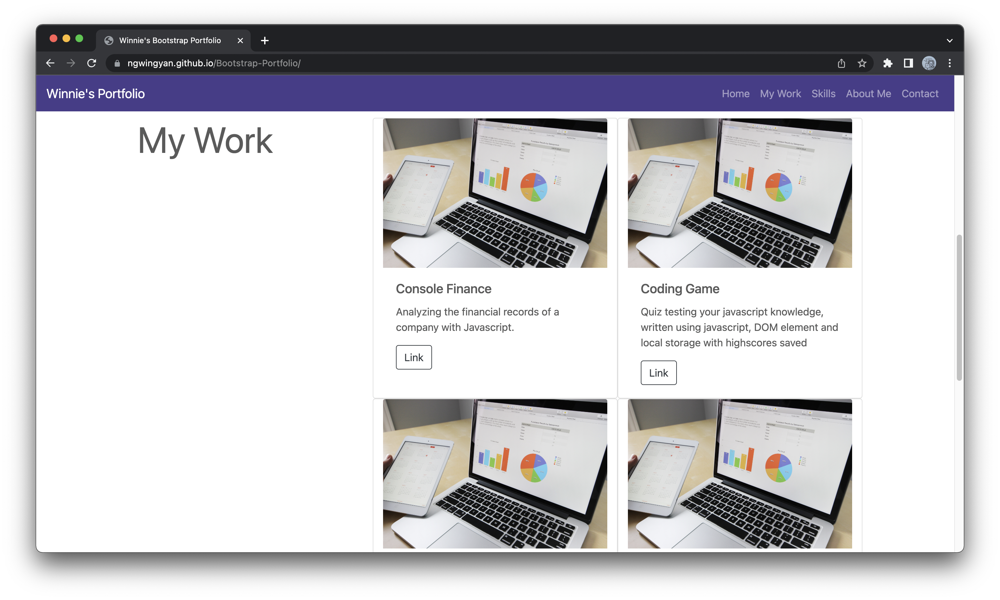
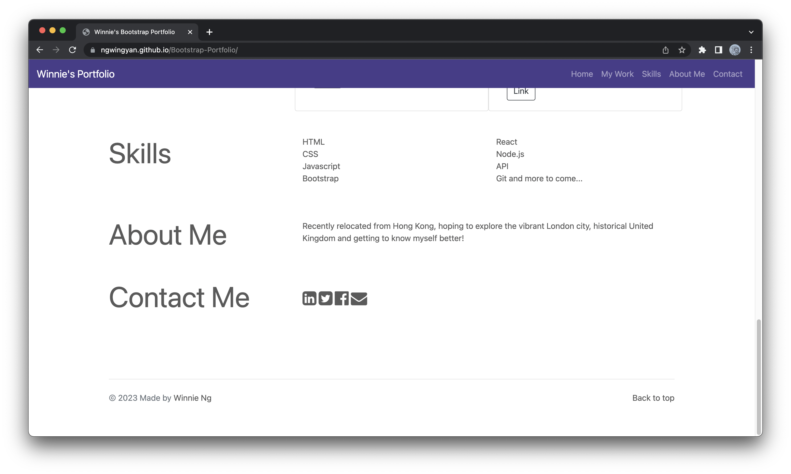

# Bootstrap-Portfolio

## Purpose
- to create a portfolio page using Bootstrap and advanced CSS linking projects for future professional use

## Feature and screenshot
- Navbar and jumbotron image

- Work section with bootstrap card and grid design

- Other section and footer

## Technology used
- HTML, CSS, Bootstrap with responsive design

## License
- Please refer to the license in the repository.

## Link
- Repository URL - https://github.com/ngwingyan/Bootstrap-Portfolio/
- Deployed URL - https://ngwingyan.github.io/Bootstrap-Portfolio/